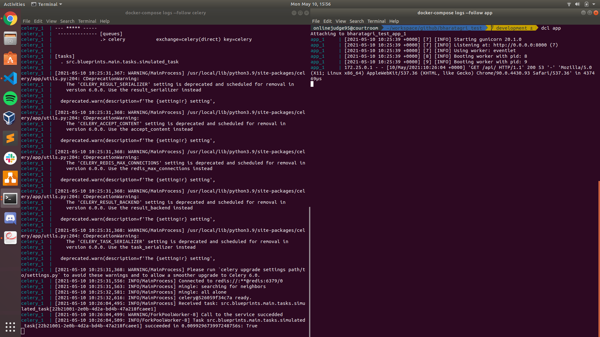
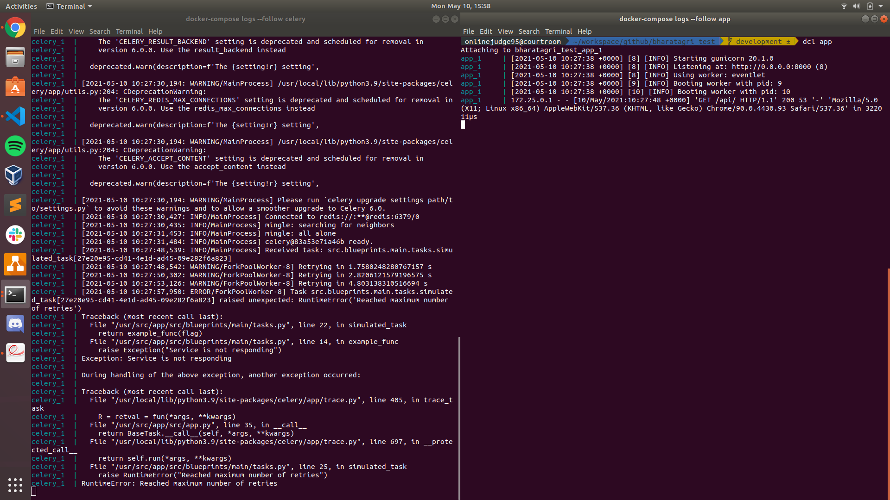

bharatagri_test
===============

## Endpoints
This app provides following 2 endpoints
1. `GET /health`
2. `GET /api`

## Setup
1. Build the docker images using `docker-compose build --compress`
2. Once the images are build, create a `.env` file using `.env.example` as a template `cp .env.example .env`
3. Now start the services using `docker-compose up --detach`
4. Monitor the celery service logs using `docker-compose logs --follow celery`
5. The `CIRCUIT_BREAKER_FLAG` variable is used to simulate the behavious of a faulty service.
   In terms of codebase the `example_function` behaves good for values `> 5` and bad otherwise.

## Screenshots
1. For case when the retry passes 
2. For case when the retry fails 
